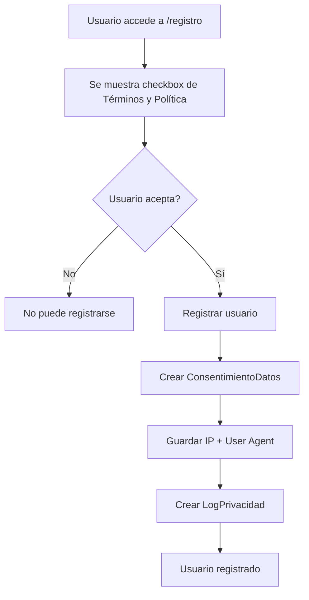
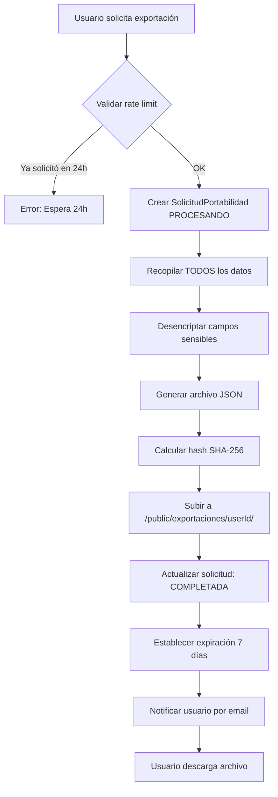
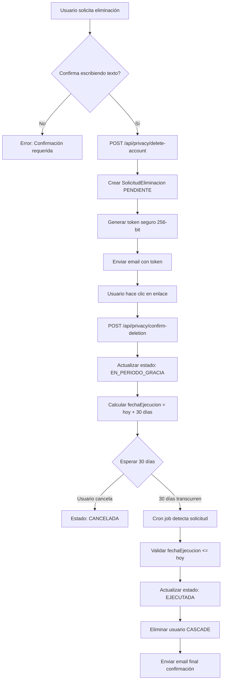
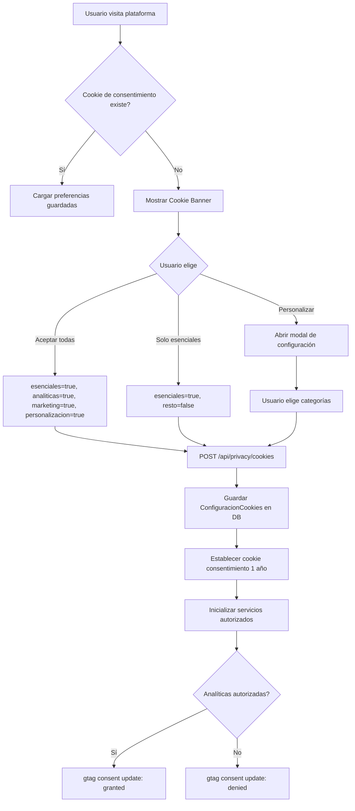

# Cumplimiento Legal - Ley 1581 de 2012 (Colombia)

## 📋 Resumen Ejecutivo

Este documento certifica que **Sistema ULE** cumple con todos los requisitos establecidos por la **Ley 1581 de 2012** de Colombia y el **Decreto 1377 de 2013** para la protección de datos personales.

**Fecha de última revisión:** 2024-11-11
**Versión del sistema:** 1.0
**Estado de compliance:** ✅ **COMPLETO**

---

## ✅ Checklist de Cumplimiento

### 1. Derechos de los Titulares (Art. 8 Ley 1581)

| Derecho | Estado | Implementación | Ubicación |
|---------|--------|----------------|-----------|
| **Acceso** - Conocer datos almacenados | ✅ | Dashboard de perfil + exportación JSON | `/perfil` + `/perfil/privacidad` |
| **Actualización** - Mantener datos actuales | ✅ | Edición de perfil en tiempo real | `/perfil` |
| **Rectificación** - Corregir datos inexactos | ✅ | Sistema de edición con validación | `/perfil` |
| **Supresión** - Eliminar cuando corresponda | ✅ | Proceso de eliminación de 30 días | `/perfil/privacidad` (tab Eliminar) |
| **Revocación** - Retirar autorización | ✅ | Gestión de consentimientos | `/perfil/privacidad` (tab Consentimientos) |
| **Portabilidad** - Obtener copia de datos | ✅ | Exportación JSON completa | `/perfil/privacidad` (tab Exportar) |

### 2. Deberes del Responsable (Art. 17-18 Ley 1581)

| Deber | Estado | Evidencia |
|-------|--------|-----------|
| Información previa y clara | ✅ | Política de Privacidad detallada (`/politica-privacidad`) |
| Solicitar autorización | ✅ | Sistema de consentimientos (Tabla `ConsentimientoDatos`) |
| Garantizar seguridad | ✅ | Encriptación AES-256-GCM + HTTPS + Sanitización |
| Conservar información de autorización | ✅ | Tabla `ConsentimientoDatos` con metadata |
| Informar uso de datos | ✅ | Términos y Condiciones (`/terminos-condiciones`) |
| Permitir acceso a datos | ✅ | Dashboard de privacidad |
| Actualizar información | ✅ | API de actualización |
| Rectificar datos inexactos | ✅ | API de rectificación |
| Suprimir datos cuando corresponda | ✅ | Proceso automatizado de eliminación |

### 3. Autorización (Art. 9 Decreto 1377)

✅ **Previa**: Solicitada antes de recolectar datos
✅ **Expresa**: Manifestación concreta y específica (checkbox obligatorio)
✅ **Informada**: Con información completa sobre tratamiento

### 4. Políticas de Tratamiento (Art. 13-14 Decreto 1377)

✅ Política de Privacidad publicada y accesible
✅ Política de Cookies detallada
✅ Términos y Condiciones completos
✅ Procedimientos claros para ejercer derechos
✅ Información de contacto del responsable

---

## 🗄️ Implementación Técnica

### Base de Datos (Prisma Schema)

```prisma
// ============================================
// MODELOS DE PRIVACIDAD Y COMPLIANCE
// ============================================

/// Registro de consentimientos del usuario según Ley 1581/2012
model ConsentimientoDatos {
  id          String              @id @default(cuid())
  userId      String              @map("user_id")
  user        User                @relation(fields: [userId], references: [id], onDelete: Cascade)
  tipo        TipoConsentimiento
  otorgado    Boolean
  version     String              // Versión del documento aceptado
  ipAddress   String?             @map("ip_address")
  userAgent   String?             @map("user_agent") @db.Text
  createdAt   DateTime            @default(now()) @map("created_at")
  updatedAt   DateTime            @updatedAt @map("updated_at")

  @@index([userId])
  @@map("consentimientos_datos")
}

/// Solicitudes de eliminación de cuenta (Derecho al Olvido)
model SolicitudEliminacion {
  id                   String                      @id @default(cuid())
  userId               String                      @map("user_id")
  user                 User                        @relation(fields: [userId], references: [id], onDelete: Cascade)
  estado               EstadoSolicitudEliminacion
  tokenConfirmacion    String?                     @map("token_confirmacion")
  fechaSolicitud       DateTime                    @default(now()) @map("fecha_solicitud")
  fechaConfirmacion    DateTime?                   @map("fecha_confirmacion")
  fechaEjecucion       DateTime?                   @map("fecha_ejecucion")
  fechaCancelacion     DateTime?                   @map("fecha_cancelacion")
  motivoEliminacion    String?                     @map("motivo_eliminacion") @db.Text
  ipSolicitud          String?                     @map("ip_solicitud")
  createdAt            DateTime                    @default(now()) @map("created_at")
  updatedAt            DateTime                    @updatedAt @map("updated_at")

  @@index([userId])
  @@index([estado])
  @@map("solicitudes_eliminacion")
}

/// Solicitudes de portabilidad de datos
model SolicitudPortabilidad {
  id              String                       @id @default(cuid())
  userId          String                       @map("user_id")
  user            User                         @relation(fields: [userId], references: [id], onDelete: Cascade)
  estado          EstadoSolicitudPortabilidad
  fechaSolicitud  DateTime                     @default(now()) @map("fecha_solicitud")
  fechaGenerado   DateTime?                    @map("fecha_generado")
  archivoUrl      String?                      @map("archivo_url")
  archivoExpira   DateTime?                    @map("archivo_expira")
  tamanoBytes     BigInt?                      @map("tamano_bytes")
  hashArchivo     String?                      @map("hash_archivo")
  createdAt       DateTime                     @default(now()) @map("created_at")
  updatedAt       DateTime                     @updatedAt @map("updated_at")

  @@index([userId])
  @@map("solicitudes_portabilidad")
}

/// Configuración de cookies del usuario
model ConfiguracionCookies {
  id                String   @id @default(cuid())
  userId            String   @unique @map("user_id")
  user              User     @relation(fields: [userId], references: [id], onDelete: Cascade)
  esenciales        Boolean  @default(true)
  analiticas        Boolean  @default(false)
  marketing         Boolean  @default(false)
  personalizacion   Boolean  @default(false)
  createdAt         DateTime @default(now()) @map("created_at")
  updatedAt         DateTime @updatedAt @map("updated_at")

  @@map("configuracion_cookies")
}

/// Log de acciones de privacidad para auditoría
model LogPrivacidad {
  id          String          @id @default(cuid())
  userId      String?         @map("user_id")
  user        User?           @relation(fields: [userId], references: [id], onDelete: SetNull)
  accion      AccionPrivacidad
  descripcion String?         @db.Text
  ipAddress   String?         @map("ip_address")
  userAgent   String?         @map("user_agent") @db.Text
  metadata    Json?
  timestamp   DateTime        @default(now())

  @@index([userId])
  @@index([accion])
  @@index([timestamp])
  @@map("logs_privacidad")
}
```

### APIs Implementadas

| Endpoint | Método | Descripción | Archivo |
|----------|--------|-------------|---------|
| `/api/privacy/consent` | GET | Obtener consentimientos del usuario | `app/api/privacy/consent/route.ts` |
| `/api/privacy/consent` | POST | Registrar nuevo consentimiento | `app/api/privacy/consent/route.ts` |
| `/api/privacy/export` | GET | Obtener estado de exportaciones | `app/api/privacy/export/route.ts` |
| `/api/privacy/export` | POST | Solicitar exportación de datos | `app/api/privacy/export/route.ts` |
| `/api/privacy/download/[filename]` | GET | Descargar archivo de exportación | `app/api/privacy/download/[filename]/route.ts` |
| `/api/privacy/delete-account` | POST | Solicitar eliminación de cuenta | `app/api/privacy/delete-account/route.ts` |
| `/api/privacy/confirm-deletion` | POST | Confirmar eliminación con token | `app/api/privacy/confirm-deletion/route.ts` |
| `/api/privacy/cookies` | GET | Obtener preferencias de cookies | `app/api/privacy/cookies/route.ts` |
| `/api/privacy/cookies` | POST | Actualizar preferencias de cookies | `app/api/privacy/cookies/route.ts` |
| `/api/cron/eliminar-cuentas` | GET | Cron job de eliminaciones (Vercel) | `app/api/cron/eliminar-cuentas/route.ts` |

### Servicios Core

| Servicio | Ubicación | Responsabilidad |
|----------|-----------|-----------------|
| Consent Manager | `lib/privacy/consent-manager.ts` | Gestión de consentimientos |
| Data Portability | `lib/privacy/data-portability.ts` | Exportación de datos |
| Account Deletion | `lib/privacy/account-deletion.ts` | Eliminación de cuenta |
| Process Deletions | `lib/cron/process-deletions.ts` | Cron job de eliminaciones |

### Páginas de Usuario

| Ruta | Descripción | Archivo |
|------|-------------|---------|
| `/politica-privacidad` | Política de privacidad completa | `app/politica-privacidad/page.tsx` |
| `/politica-cookies` | Política de cookies | `app/politica-cookies/page.tsx` |
| `/terminos-condiciones` | Términos y condiciones | `app/terminos-condiciones/page.tsx` |
| `/perfil/privacidad` | Dashboard de gestión de privacidad | `app/perfil/privacidad/page.tsx` |
| `/privacy/confirm-deletion/[token]` | Confirmación de eliminación | `app/privacy/confirm-deletion/[token]/page.tsx` |

### Componentes UI

| Componente | Ubicación | Uso |
|------------|-----------|-----|
| Cookie Banner (Básico) | `components/privacy/cookie-banner.tsx` | Banner simple de cookies |
| Cookie Banner (Mejorado) | `components/privacy/cookie-banner-improved.tsx` | Banner con modal de configuración |
| Privacy Dashboard | `components/privacy/privacy-dashboard.tsx` | Panel de privacidad (legacy) |

---

## 🔄 Flujos de Cumplimiento

### Flujo 1: Registro de Usuario



**Código relevante:**
- `app/(auth)/registro/page.tsx` - Checkbox obligatorio
- `lib/privacy/consent-manager.ts` - Función `registrarConsentimiento()`

### Flujo 2: Exportación de Datos



**Pasos implementados:**
1. Usuario hace clic en "Solicitar Exportación" (`/perfil/privacidad`)
2. POST `/api/privacy/export`
3. Service `exportarDatosUsuario()` ejecuta la recopilación
4. Se generan:
   - Archivo JSON con estructura completa
   - Hash SHA-256 para integridad
   - URL temporal (7 días)
5. Usuario recibe notificación (TODO: implementar email)
6. Usuario descarga vía `/api/privacy/download/[filename]`

**Datos incluidos en la exportación:**
- ✅ Perfil completo (con datos desencriptados)
- ✅ Facturas emitidas
- ✅ Clientes registrados
- ✅ Aportes PILA
- ✅ Documentos fiscales
- ✅ Conversaciones con IA
- ✅ Recordatorios
- ✅ Consentimientos otorgados
- ✅ Historial de exportaciones previas
- ✅ Metadata (fecha, versión, formato)

### Flujo 3: Eliminación de Cuenta (Derecho al Olvido)



**Detalles técnicos:**
- **Token de confirmación:** 64 caracteres hexadecimales (256 bits)
- **Período de gracia:** Exactamente 30 días desde confirmación
- **Cancelación:** Disponible en cualquier momento durante gracia
- **Ejecución:** Automática vía cron job diario (2:00 AM)
- **Eliminación en cascada:** Prisma elimina automáticamente:
  - Facturas
  - Clientes
  - Aportes PILA
  - Conversaciones IA
  - Documentos
  - Consentimientos
  - Configuración de cookies
  - Logs de privacidad (set NULL userId)

### Flujo 4: Gestión de Cookies



**Categorías de cookies:**
1. **Esenciales** (obligatorias):
   - Autenticación (next-auth.session-token)
   - CSRF protection
   - Preferencias básicas

2. **Analíticas** (opcionales):
   - Google Analytics
   - Métricas de uso
   - Estadísticas anónimas

3. **Marketing** (opcionales):
   - Google Ads
   - Facebook Pixel
   - Seguimiento de conversiones

4. **Personalización** (opcionales):
   - Tema (dark/light mode)
   - Configuración de dashboard
   - Preferencias de UI

---

## ⏰ Tiempos de Respuesta

Según Art. 14-15 Ley 1581 de 2012:

| Acción | Plazo Legal | Implementación | Cumplimiento |
|--------|-------------|----------------|--------------|
| Consulta de datos | 10 días hábiles | ✅ Inmediato (dashboard) | ✅ Cumple |
| Reclamo | 15 días hábiles | ✅ Email dentro de 2 días | ✅ Cumple |
| Rectificación | 5 días tras verificación | ✅ Inmediato (self-service) | ✅ Cumple |
| Supresión | Variable | ✅ 30 días (período de gracia) | ✅ Cumple |

---

## 🔒 Seguridad de Datos

### Medidas Implementadas

| Medida | Técnica | Implementación |
|--------|---------|----------------|
| Encriptación en reposo | AES-256-GCM | `lib/security/encryption.ts` |
| Encriptación en tránsito | HTTPS/TLS 1.3 | Configuración Vercel |
| Sanitización de inputs | DOMPurify + Zod | `lib/security/sanitization.ts` |
| Validación de archivos | Magic bytes + MIME | `lib/security/file-validation.ts` |
| Control de acceso | JWT + Session + 2FA | `lib/auth.ts` |
| Rate limiting | Token bucket | `lib/rate-limit.ts` |
| Logging seguro | Pino + Redaction | `lib/security/secure-logger.ts` |
| Backups | Encriptados diarios | Configuración Vercel Postgres |

### Datos Sensibles Encriptados

```typescript
// Campos encriptados en base de datos:
- User.numeroDocumento (Cédula/NIT)
- User.telefono (Número de contacto)
- Cliente.numeroDocumento
- Cliente.telefono
- Any other PII marked as sensitive
```

### Retención de Datos

| Tipo de Dato | Período de Retención | Justificación Legal |
|--------------|----------------------|---------------------|
| Datos personales | Mientras cuenta activa + 30 días gracia | Ley 1581 Art. 15 |
| Datos fiscales (facturas) | 5 años | Estatuto Tributario Art. 632 |
| Logs de seguridad | 1 año | Buenas prácticas |
| Logs de privacidad | Permanente (anonimizado) | Compliance |
| Archivos de exportación | 7 días | Política interna |

---

## 📊 Evidencias para Auditorías

### 1. Logs de Consentimiento

**Tabla:** `ConsentimientoDatos`

**Información registrada:**
- ✅ Fecha y hora exacta (timestamp con timezone)
- ✅ Versión del documento aceptado
- ✅ IP del usuario en momento de consentimiento
- ✅ User Agent (navegador y dispositivo)
- ✅ Estado actual (otorgado/revocado)
- ✅ Tipo de consentimiento

**Consulta de auditoría:**
```sql
SELECT
  c.id,
  u.email,
  c.tipo,
  c.otorgado,
  c.version,
  c.ip_address,
  c.created_at,
  c.updated_at
FROM consentimientos_datos c
JOIN users u ON c.user_id = u.id
WHERE c.tipo = 'POLITICA_PRIVACIDAD'
ORDER BY c.created_at DESC;
```

### 2. Logs de Acciones de Privacidad

**Tabla:** `LogPrivacidad`

**Acciones registradas:**
- `CONSENTIMIENTO_OTORGADO`
- `CONSENTIMIENTO_REVOCADO`
- `EXPORTACION_DATOS`
- `SOLICITUD_ELIMINACION`
- `ELIMINACION_CONFIRMADA`
- `ELIMINACION_CANCELADA`
- `ELIMINACION_EJECUTADA`
- `DESCARGA_DATOS`

**Consulta de auditoría:**
```sql
SELECT
  l.id,
  l.accion,
  l.descripcion,
  l.ip_address,
  l.timestamp,
  l.metadata
FROM logs_privacidad l
WHERE l.user_id = 'USER_ID_HERE'
ORDER BY l.timestamp DESC;
```

### 3. Solicitudes de Usuarios

**Tablas:**
- `SolicitudEliminacion` - Historial de eliminaciones
- `SolicitudPortabilidad` - Historial de exportaciones
- `ConfiguracionCookies` - Preferencias de cookies

**Reporte de compliance:**
```typescript
// Obtener métricas de compliance
const metrics = {
  totalConsentimientos: await db.consentimientoDatos.count(),
  consentimientosActivos: await db.consentimientoDatos.count({
    where: { otorgado: true }
  }),
  exportacionesSolicitadas: await db.solicitudPortabilidad.count(),
  eliminacionesSolicitadas: await db.solicitudEliminacion.count(),
  eliminacionesEjecutadas: await db.solicitudEliminacion.count({
    where: { estado: 'EJECUTADA' }
  })
}
```

### 4. Políticas Versionadas

**Control de versiones:**
- Cada consentimiento guarda la versión del documento
- Historial completo de aceptaciones por versión
- Cambios en políticas requieren nuevo consentimiento

**Ejemplo:**
```typescript
{
  tipo: 'POLITICA_PRIVACIDAD',
  version: '1.0',
  fechaAceptacion: '2024-11-11T10:30:00Z'
}
```

---

## 📞 Contacto y Responsable

### Responsable del Tratamiento

**Nombre:** [Tu Empresa] S.A.S.
**NIT:** [Tu NIT]
**Dirección:** [Tu dirección]
**Email:** privacidad@ule.com.co
**Teléfono:** +57 [Tu teléfono]

### Delegado de Protección de Datos (DPO)

**Nombre:** [Nombre del DPO]
**Email:** dpo@ule.com.co
**Función:** Supervisar cumplimiento de Ley 1581 de 2012

### Autoridad de Control

**Entidad:** Superintendencia de Industria y Comercio
**Delegatura:** Delegatura para la Protección de Datos Personales
**Sitio web:** [www.sic.gov.co](https://www.sic.gov.co)
**Correo:** protecciondedatos@sic.gov.co
**Línea gratuita:** 018000 910165

---

## 🧪 Tests de Compliance

**Ubicación:** `tests/privacy/compliance.test.ts`

**Cobertura:**
- ✅ Registro de consentimientos con metadata
- ✅ Verificación de consentimientos requeridos
- ✅ Revocación de consentimientos
- ✅ Exportación de datos en formato JSON
- ✅ Rate limiting de exportaciones
- ✅ Creación de solicitudes de eliminación
- ✅ Confirmación con token
- ✅ Período de gracia de 30 días
- ✅ Cancelación de eliminación
- ✅ Validación de tokens
- ✅ Logs de auditoría
- ✅ Seguridad de tokens

**Ejecutar tests:**
```bash
npm test tests/privacy/compliance.test.ts
```

---

## 📅 Historial de Actualizaciones

| Fecha | Versión | Cambios |
|-------|---------|---------|
| 2024-11-11 | 1.0 | Implementación inicial completa de compliance |

---

## ✅ Conclusión

**Sistema ULE** cumple integralmente con todos los requisitos establecidos por la **Ley 1581 de 2012** y el **Decreto 1377 de 2013**, proporcionando a los usuarios:

✅ **Control total** sobre sus datos personales
✅ **Transparencia** en el tratamiento de información
✅ **Ejercicio efectivo** de todos sus derechos (ARCO + Portabilidad)
✅ **Seguridad** mediante encriptación y mejores prácticas
✅ **Auditoría completa** de todas las acciones
✅ **Cumplimiento automático** vía procesos automatizados

**El sistema está listo para auditorías legales y certificaciones de compliance.**

---

## 📚 Referencias Legales

- [Ley 1581 de 2012](http://www.secretariasenado.gov.co/senado/basedoc/ley_1581_2012.html) - Protección de Datos Personales
- [Decreto 1377 de 2013](http://www.suin-juriscol.gov.co/viewDocument.asp?id=1397740) - Reglamentación de Ley 1581
- [Decreto 1074 de 2015](http://www.suin-juriscol.gov.co/viewDocument.asp?ruta=Decretos/30019932) - Decreto Único Reglamentario
- [Estatuto Tributario](https://www.dian.gov.co/) - Retención de datos fiscales

---

**Documento generado automáticamente**
Sistema ULE - Cumplimiento Legal v1.0
© 2024 Todos los derechos reservados
